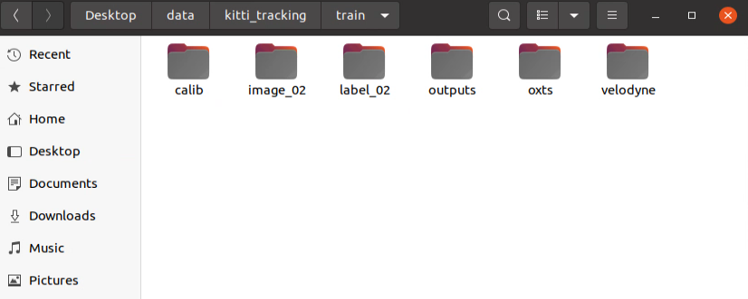

3D multi-object tracking (MOT) is essential to applications such as autonomous driving. The methods can be splitted in to two main categories: Tracking by Detection (TBD) architectures where a tracking algorithm is applied using obtained detections without having any effect to detection results, and Joint Detection and Tracking Methods (JDT) where the tracking and detections architectures form a unified model and working by effecting each others performance mutually. 

There are various approachs both for implementing a TBD or JDT model reviewed in the following figure:


In this study, a TBD architecture is implemented by combination of two different Kalman Filter based track methods to obtain a 3D Multi Object Tracking system.


https://user-images.githubusercontent.com/20625822/174858095-02c05e5e-5956-45b9-b766-2c86346a5c40.mov


# OpenPCDET submodule

OpenPCDET framework is used for Object Detection step to train different models using KITTI dataset with Lidar. <b> detection_report.md </b> file in this repo explains all the steps done for object detection with the usage of the submodule having different example script usages for data preparing, visualization, train and inference.

# Tracking 

<b> tracking_report.md </b> gives a detailed information about the model architecture and each of the components as well as the evaluation code usage. Other than that the functions and their usages explained above:

<b> track.py : </b> Main program to realize tracking. Each frame is processed for object detection with the OpenPCDET trained model. After obtaining 1 frame's detection results, tracking algorithm works on top of it and after obtaining tracking result it is passed to the second frame to obtain inference results and call tracking algorithm again.

Example usage:

```

 python tracking.py --cfg_file /home/yagmur/lidartracking/OpenPCDet/tools/cfgs/kitti_models/second.yaml --ckpt /home/yagmur/Desktop/output/kitti_models/second/default_15032022/ckpt/checkpoint_epoch_80.pth --base_path /home/yagmur/Desktop/data/kitti_tracking/train --visualize --mode save

```

base_path : data path with calibration, oxts, velodyne files

visulaize : show ground truth boxes 

mode : save or show, save argument for saving the tracking outputs frame by frame, show argument for just visualizing but not saving

Folder structure of data path should be as follows:



The outputs folder will contain the results for each sequence in your data (in your velodyne folder)

<b> kitti_calib.py : </b> The helper program to read calibration files and process the transformation between lidar - image frame  

<b> kitti_oxts.py : </b>  The helper program to read oxts file of KITTI.

<b> track_results_vs.py : </b> The helper program to convert tracking 3D bounding boxes from lidar to image space for visualizing them with left camera images from KITTI dataset

<b> img_movie.py : </b> The helper program to create videos from tracking output images.

