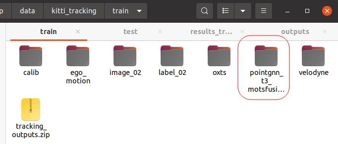
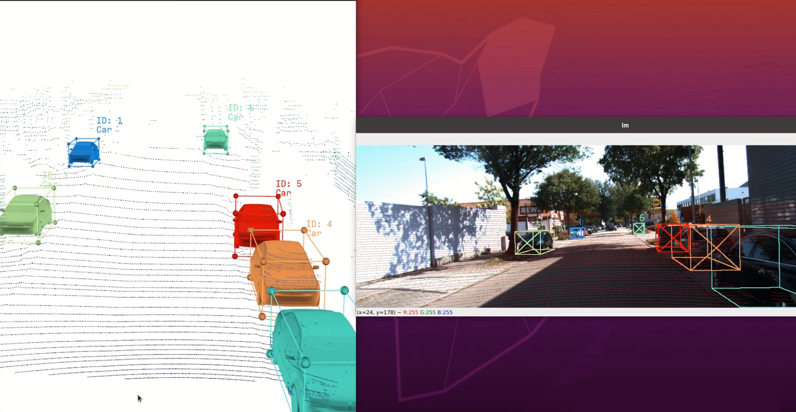
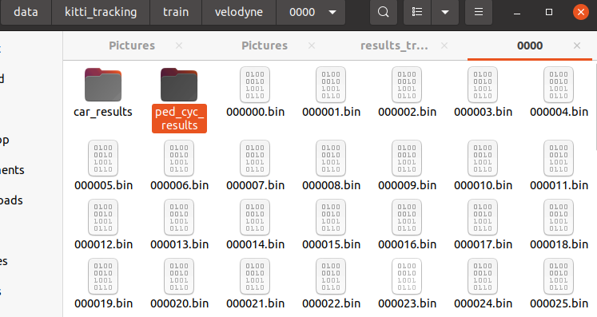

# Fusion with EagerMOT explained

1. Clone EagerMOT official repo from https://github.com/aleksandrkim61/EagerMOT 
2. Create a new anaconda environment with : <br>
```
conda create --name EagerMOT --file requirements_conda.txt
```
3. Test if its working with prepared input: <br>
    * Pointgnn for 3D detections are dowloaded from: https://drive.google.com/drive/folders/1MpAa9YErhAZNEJjIrC4Ky21YfNj2jatM 
    * RRC 2D detections are dowloaded from: https://drive.google.com/file/d/1ZR1qEf2qjQYA9zALLl-ZXuWhqG9lxzsM/view 
    * update POINTGNN_DETS_DIR and MOTSFUSION_RRC_DIR in EagerMOT/inputs/utils.py
    * cd EagerMOT <br>
       python run_tracking.py 
    * The results will be saved in your base data directory with <b> pointgnn_t3_motsfusion_rrc </b> folder name

          

4. Visualize EagerMOT fusion results:
    * Clone https://github.com/hailanyi/3D-Detection-Tracking-Viewer
    * Replace tracking_det_0_0_seg_0.0_0.9_bbox_0.01_0.01_kf_dist_2d_full_[-3.5_-0.3]_0.3_a3_3_h1_2_2d_age_3_3_cleaning_0_3d/0000.txt file with EagerMOT results to /3D-Detection-Tracking-Viewer/data/tracking/label_02/0000.txt file
    * cd 3D-Detection-Tracking-Viewer <br>
      python kitti_3D_tracking_viewer.py 
    * If you want to visualize another sequence, follow the same steps and change <br> 
    label_path = r"data/tracking/label_02/<b>0000.txt</b>" and dataset = KittiTrackingDataset(root,<b> seq_id=0 </b>,label_path=label_path)
    * You will obtain the fusion results in image and lidar space at the same time:

       

5. Fusion with custom 3D detection
    * The demo.py file is updated to make OpenPCDet inference results saved in EagerMOT pointgnn format. Therefore, when you use demo.py as explained in detection_report.md, you will obtain two folders in your data/velodyne path: <b> car_results </b> and <b> ped_cyc_results </b> 

       


    * Replace the results from <b> car_results </b> with <b> pointgnn/train/results_tracking_car_auto_t3_trainval </b> and the results from <b>  ped_cyc_results </b> with  <b> pointgnn/train/results_tracking_ped_cyl_auto_trainval </b>

    * After that, just repeat the steps 3 and 4 to apply fusion tracking and visualize the results

    * You can find an example video for fusion on videos/fusion.mp4
