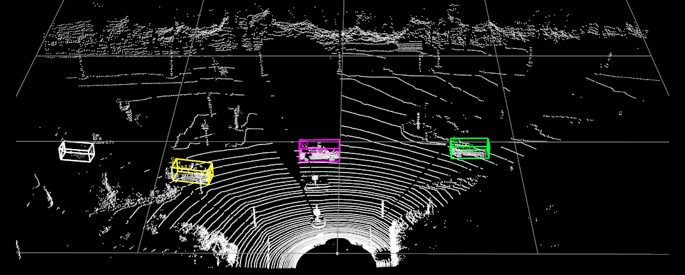
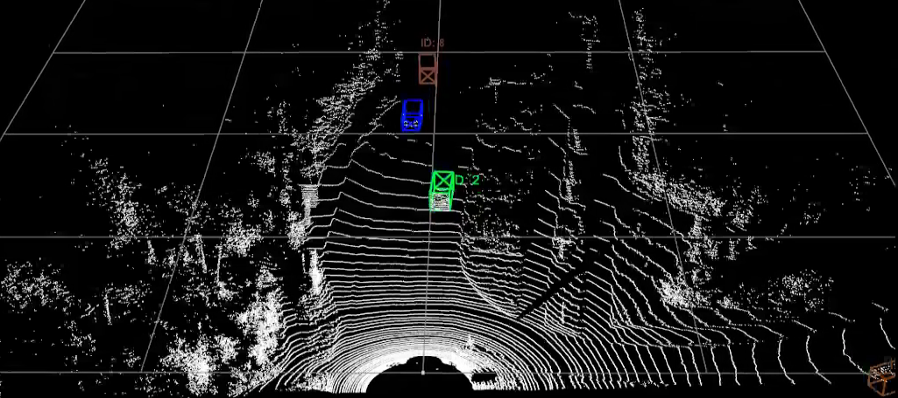

# Includings

## Kalman Filter Based Track Methods

* AB3DMOT 
    * Kalman Filter
    * IOU 
    * Houngarian Algorithm 

* Probabilistic 3D Multi-Object Tracking for Autonomous Driving 
    * Kalman Filter
    * Mahalanobis Distance
    * Greedy Algorithm 

*  Flow Chart of Tracking Mechanism  

## Optimizations

* Detected Problems
* Experiments and Proposed Solutions 

## Evaluation
* Technical Details
* Results

# Kalman Filter Based Track Methods

After an intensive research process on tracking methods, it was decided to start with the models that match between detection and trackers with the Kalman Filter, which is one of the tracking by detection methods. 
In this essence, a combination of two state-of-the-art paper's methods are implemented and testes to obtain the final model.

## 1. AB3DMOT

AB3DMOT is a very popular model designed for 3D multi object tracking using Point Cloud Data, KITTI's PointRCNN detections as the base detections and applying Kalman Filter to produce the estimations of the trackers' locations in the next frame, matching the estimations with the detections for that frame applying Houngarian Algorithm over the distance matrix created with IOU scores between the detections and trackers.

### Kalman Filter

The Kalman Filter is one of the most important and common estimation algorithms consisting of 3 main steps as Prediction, Measurement and Update. Having various fields of usage like location and navigation systems, control systems, computer graphics and much more, the usage of Kalman Filter for tracking systems will be covered in this part.

* Prediction

Having the prior knowledge of the tracker locations at frame t (x_t) and the state covariance at frame t (p_t), the locations of the trackers at the frame t+1 (x_t+1) are estimated with state covariance at frame t+1 (p_t+1)

In AB3DMOT paper, the state of the tracker consists of 10 variable as follows:

x_t = [x, y, z, theta, l, w, h, dx, dy, dz] being

x = center point of the box in x axis  
y = center point of the box in y axis  
z = center point of the box in z axis  
a = the angle between the object’s facing direction and the x-axis  
l = length of the box  
w = width of the box  
h = height of the box  
[dx, dy,dz] = represent the difference of (x, y, z) between the current and the previous frame.

The state covariance p_t is the uncertainty of the state calculated in x_t. 

* Measurement

Measurement refers to the detections comes from SECOND model for the frame t+1. In our case, these detections are 3D box locations in a 1x7 vector form:

detection = [x, y, z, a, l, w, h] being 

x = center point of the box in x axis  
y = center point of the box in y axis  
z = center point of the box in z axis  
a = the angle between the object’s facing direction and the x-axis  
l = length of the box  
w = width of the box  
h = height of the box  

Using the state prediction, state covariance prediction and measurement covariance, the measurement prediction(o'_t+1) and the uncertanty of the predicted measurements (S_t+1) are calculated.

* Update 

The last step is to update the state covariance and predicted states of the trackers using the detections to obtain the final states of the trackers at frame t+1 (x_t+1 and p_t+1)

For this step the Kalman Gain (K_t+1) is calculated using the uncertanty of the predicted measurements and the predicted state covariance

The obtained x_t+1 and p_t+1 then use as prior knowledge of the current frame to calculate the next frame states until all the frames in the sequence are processed.

### IOU

To perform the update step of Kalman, it is needed to find which Kalman predicted tracker location belongs to which detection for frame t+1 as we can see from formula of x_t+1 calculation. 

Intersection over Union (IoU) is a very common metric used usually to calculate the accuracy of a detection over its ground truth. It is a number from 0 to 1 that specifies the amount of overlap between the predicted and ground truth bounding box.

Same logic is used for calculating the overlap between all the detections and the estimated tracker locations to create a distance matrix obtaining the IOU score between all the detections and trackers.

This distance matrix then will be used to pick matches.

### Houngarian Algorithm

The Hungarian Algorithm is used to find the minimum cost in assignment problems. Using this algoritm, we can find the matches between detection and trackers by working on distance matrix. Since the bigger the IOU score, the better for this matching case, the distance matrix is updated by 1-IOU_score to find pairs giving globally minimum cost.

The logic of Houngarian Algorithm is as follows:

After determining the pairs, an IOU threshold is applied to eliminate false matches. All the matches should be higher then this specified threshold.

* Weak Point of Houngarian Match

Since the goal of the algorithl is to find the global minimum cost, not everytime the best column entry is paired with each row. Which means sometimes even if the global cost is the minimum, not every detection gets paired with the optimal choice of tracker as we can see that in the first row, although the best choice is the first row (108), the last column (150) is chosen.

### Architecture Overview

## 2. Probabilistic 3D Multi-Object Tracking for Autonomous Driving 
 
Probabilistic 3D Multi-Object Tracking for Autonomous Driving is another very popular model designed for 3D multi object tracking using the fusion of Point Cloud Data and Images from Nuscene Dataset and applying Kalman Filter to produce the estimations of the trackers' locations in the next frame, matching the estimations with the detections for that frame applying Greedy Match over Mahalanobis distance between the detections and trackers.

### Kalman Filter

The logic and the usage is pretty similar to AB3DMOT's Kalman Filter implementation. The only difference is that the state vector is defined with 1 more parameter da, being the  the difference of the angle a between the current and the previous frame. 

### Mahalanobis Distance

Mahalonobis distance is the distance between a point and a distribution. And not between two distinct points. It is effectively a multivariate equivalent of the Euclidean distance. 

In this task, it is used to calculate the disttance between the detection and predicted tracker location instead of IOU in previous model. The distance matrix is created again between each detection and tracker to be applied an matching algorithm on. In contrary from IOU, the lower the distance, the better 

### Greedy Algorithm 

The greedy algorithm is an approach for solving a problem by selecting the best option available at the moment. It doesn't worry whether the current best result will bring the overall optimal result. The algorithm never reverses the earlier decision even if the choice is wrong. 

The logic of the algorithm is as follows:

1. All the detections are randomly selected and paired with the tracker having lowest distance. 
2. Repeat the same step for 2. lowest, 3. lowest, ... n. lowest options for all the detections.
3. Travel the pair list and accept the detection - tracker pair as a match if neither the detection nor the tracker has been selected before.

* Weak Point of Greedy Match

Since the algorithm is based on finding the optimal solution for the detections selected in random order, a tracker may be matched with a detection since its the best choice for the detection, but not for the tracker if it has a lower distance with another detection. In that case, the error is not fixed and the tracker is unable to unmatch and rematch with its best choice.

## Flow Chart of Tracking Mechanism  

# Optimizations

## Detected Problems 

## 1. Overlapping Tracking Boxes which doesn't exist in Detection

There are some false positives occurs in tracking even if it doesn't come from tracking.

<b> Reason </b> : Low Mahalanobis Threshold 
    
The detection and its potential tracker has the mahalanobis distance at 0.14541635 which is higher then the default threshold 0.1. If a detection stays unmatched and it's within a few initial frames, a new tracker is created for it. Since we had already a tracker for the same detection and this tracker is not older than the max_age limit (5), we see both tracker boxes in the frame. 

## 2. False Positive on Detection passes directly to the Tracking 

In general, if a detection is not match with already existed tracker, the detection is considered as a new object and a new tracker is created directly for this object. But it's needed to decide whether its a correct object to track or a false positive. To that purpose,  
instead of visualizing the new tracker directly, we keep "track of trackers" and decide that its a good track if only the tracker gets match more min_hits (5). 

<b> Reason </b> : The Weak Point of the Starting Frames

The rule explained above is not applied for the initial frames since we can't expect a tracker takes 5 times match in first or second scene...  
This makes the initial frames weaker and all the detections passes directly to the tracking results.  

## 3. Old False Positive Tracker Comes back without Detection

With a frame_count variable, we keep track on which frame we are. For the first frames, we accept the detections directly to begin with. General conditions to create a new tracker for a new detection are applied if and only if we are beyond of first few initial frames. 

<b> Reason </b> : Different frame count parameter for each class

This frame count is kept individually for each class (which is a bug for me), and even if we are out of frame count limit in general, if we see a cyclyst 2. time in the 100. frame, still this frame count limit is applicable and it lets all the detections or old trackers pass.

## 4. Tracker Box Comes Bad If the Detection is lost for a few frame

The Kalman prediction without detection update doesn't work very well if the detection is lost while the object is orienting. 

<b> Reason </b> : Kalman Filter's Constant Velocity 

Since it is a constant velocity Kalman Filter, the last speed calculated between the last frame and previous frame becomes directly the new dx dy dz da for the next frame Kaman prediction. This logic works well if the object doesnt change its orientation significantly since the last frame or a detection is matched. Otherwise the box gets pretty uncorrect.

## 5. Losing Trackers too Early

A lot of example case shows that a tracker gets removed too fast, (after only 2 frame that they didn't have any match) and this situation causes to have different ID trackers for the same object.

<b> Reason </b> : Low Maximum Age Threshold

Frame 8 - car ID 7  
  
Frame 11 - car ID 13  
  
Frame 25 - car ID 23  
  

## 6. Mobile Lidar Case - Ego Motion Compensation

In case of losing the detection for a few frame, beside of wrong match problem explained and solved in section Mahalanobis Threshold - Match Deny Mechanism, if the lidar is not fixed but mobile, a stable object may be considered as moving with the same speed of lidar. 

<b> Reason </b> : Ego Motion - Lidar Mobile Case

When the lidar is mobile, the coordinates of the object in lidar frame changes even if the object is not moving. Since the model is not aware of that situation, it considers the lidar move as object move. This problem causes that Kalman Prediction is calculated with wrong speeds (dx dy dz da) for the next frame. If we have a correct detection match with this false calculated kalman box, we don't see anything wrong due to the correction step. But if we don't have the detection, since the tracker is not corrected but just updated by Kalman Prediction, we see that the object moves in a wrong direction. 

Example1 - Linear Ego Motion Effect

It is seen that Car ID 10, which is a stationary car object moves in the same direction with ego motion. Instead of getting closer to the lidar since its stable and the lidar vehicle moves toward this object, the location of the object in lidar frame stays stable since the object is moved at the same direction too.

Example2 - Angular Ego Motion Effect

The same problem arises when the lidar vehicle orients. It is seen that the object rotates in the same direction.

## Experiments and Proposed Solutions 

## 1. Mahalanobis Threshold

For the first problem, this threshold has been changed to see different results.

The more this threshold is increased, the less we obtain overlap problem since close detections and tracker predictins gets matched without any problem. On the other hand, using a more flexible threshold occurs another problem :

When a tracker stays unmatched because the detection is lost for that frame, a new possibility of being matched for this tracker with a not so close detection (mostly a FP detection) came up.

Frame 112: 

Frame 122:

Frame 125:

<b> Match Deny Mechanism </b>

After examining the change on trackers' positions, I decided to use the distance between the last frame's position and the current frame's position to decide if the tracker is moving abnormal. Now the algorithm denies the matches comes from greedy algorithm if the distance is higher than 4m. Since the match is denied, the updated tracker is sent to the last location and the state of the tracker is updated for the next kalman prediction.The threshold is calculated as follows:

* In usual cases we obtain the distance between last and current frame around 1.5.
* Since the lidar sensor work at 10Hz, we obtain 1 frame per 0.1 second.
* 0.1 sn -> 1.5m --> 3600 sn -> 54000m 
* So if a car moves 1.5 m between the frames, this corresponds to 54km/h which is very reasonable.
* According to my analyses, these false matches has around 11m distance which corresponds to 396km/h speed for a car which is very clearly wrong.
* Instead of putting the threshold so high as near 11, I decided to use more realistic one to catch some other false matches which may still occur with lower than 11m distance and set the threshold to 4.5 which corresponds to 162km/h   

<b> Result </b>

## 2. Additional Conditions for Initial Frames

Since initial frames are exempt from the general conditions which make the tracking system weaker to allow pass wrong detections to the tracker, I added a threshold for initial frame's detections especially for the classes more fragile like Cyclist and Pedestrian. Only the detections having prediction score higher than this threshold(0.65) are accepted to create trackers for initial frames.

## 3. Frame Count Parameter 

The frame count parameter in original code was different for each class. It has been changed to be global. 

## 4. Kalman Filter Parameters Updated

Default:
    
self.kf.R[0:,0:] *= 10.   # measurement uncertainty  
self.kf.P[7:,7:] *= 1000. # state uncertainty,  
self.kf.P *= 10.    
self.kf.Q[7:,7:] *= 0.01 # process uncertainty  

Exp - 1 

self.kf.R[0:,0:] *= 100.    
self.kf.P[7:,7:] *= 1000.  
self.kf.P *= 10.    
self.kf.Q[7:,7:] *= 0.01  

It is seen that the results get even worse since the uncertainty of the detections is increased and the false orientation predictions of Kalman can't be updated enough with detections to correct the measurement.

Exp - 2

self.kf.R[0:,0:] *= 1.    
self.kf.P[7:,7:] *= 1000.  
self.kf.P *= 10.    
self.kf.Q[7:,7:] *= 0.01   

This time the box orientation is obtained very well but we realize that the Kalman Prediction lost its effect so when the object is not detected, Kalman Prediction can't effectively update the tracker to move on on the same direction that it was moving before losing the detection. At the end since the tracker box stayed far, we can't obtain a match when we detect the object again and the model assigns a new tracker with a new ID to the same object.

Exp - 3

self.kf.R[0:,0:] *= 10.    
self.kf.P[7:,7:] *= 1000.  
self.kf.P *= 10.    

Instead of reducing the detection noise, the prediction noise is augmented.  (The default of Q is an idendity matrix so if self.kf.Q[7:,7:] *= 0.01 line is removed dx dy dz da is augmented to 1)

We see that with this approach we can obtain very good results on orienting boxes without causing any additional problem.

## 5. Max Age Parameter is updated

Considering there are occlusion cases where we lost detection for a tracker but the object is still there (undetectable because of an occlusion) even more than 100 frames, I augmented the max age parameter to be 150 and kept the old threshold not for deleting the tracker permanently but not to visualize it until the object is detected again.  

## 6. Ego Motion Compensation

To handle with mobile lidar case, the velocity of the lidar vehicle is used to update the position of Kalman Predictions. For that purpose, linear and angular velocities given in OXTS files in Kitti Tracking dataset is used.

1. Orientation

    The rotation matrix is calculated using the yaw angle speed of lidar vehicle. This matrix is applied to the Kalman Prediction boxes to correct the object locations in lidar frame

    The angular speed of the vehicle is given in OXTS file as wz in rad/s unit. Counter clockwise direction is accepted as positive direction.

2. Translation

    The translation of the lidar vehicle is calculated by linear speed in x and y directions. The object is translated in the opposite direction of this movement to correct the position.

    The linear speed of the vehicle is given in OXTS file as vf and vl in m/s unit. 

    

## Local Match Deny Mechanism

Different sequences have different properties depending on where the sequence is taken (city, auto road, urban etc). The lidar case (stationary or mobile), the object case(stationary or mobile, if mobile, the direction according to the lidar) effects the relative speed of the object which is very important to determine the Mahalanobis threshold as well as Match Deny Mechanism threshold. 

In other words, a reasonable match deny threshold, which eliminates the wrong matchs by looking the displacement of the tracker between the current and previous frame, may change depending on the lidar - object motion. A car object moving with the same absolute velocity may have different relative velocities according the direction of the move. 

As an example case, in the following frames the Kalman Predictions and the Detections are visualized where we see a true match is denied since the distance between matched tracker and the detection is 5.76 which makes 207 km/h. In stationary lidar or mobile lidar + moving car in parallel direction case, this distance would be clearly a sign for false match, but in this case it's a true match since 207 km/h relative velocity corresponds an absolute velocity around 100 km/h, which is still a reasonable speed but denied by match deny mechanism. 

1- A new detection comes

2- A new tracker is initialized for that new detection directly at the same location

3- Kalman prediction for the same tracker in the next frame. Since the velocity variables in the state vector is initialized with 0 and its updated after the first match, it is seen that Kalman Prediction comes at the same location with the last frame meanwhile the car didn't stay stable and moved through the lidar vehicle. 

Therefore we obtain Kalman Prediction and Detection for the next frame with a distance 5.76.

4- Since the match is denied and the Kalman Prediction is not corrected, the prediction and detections boxes continues to diverge.

Match deny mechanism is created to eliminate some false matches. These false matches are coming especially in crowded scenes like city scenes and a small threshold is needed to eliminate false matches since the cars doesn't move so fast in general. 
On the other hand in the scenes having not a lot objects like auto roads, where we see just a few car object moving faster than city scenes, not false matches occurs like in city scenes and to not eliminate the true matches a higher threshold should be chosen or the match deny mechnasim should be removed.
 
To not lose the true matches independently if the lidar is mobile or not, if the object moves parallel or through the lidar, I decided to calculate the absolute speed of the objects before going to match deny mechanism

## 7. Greedy Match Review

It is mentioned that both greedy and houngarian match algorithms have some weak points. Since it is decided to continue with greedy algorithm, I updated the method to cover its main weak point. According to that:

* If an already matched tracker is chosen as the lowest distant tracker for another detection, instead of ignoring it and to assign next lowest tracker to that detection, it is checked if the tracker is assigned to a detection having higher distance.

* If the assigned detection has a higher distance than the current possible pair, the old match is removed and the tracker is assigned to this later coming detection.

* If a detection loses its tracker by this new rule, the standard greedy algorithm steps continue to be applied for this detection by adding it to the list of detections that have not yet been matched to any tracker.

# Evaluation

## Technical Details

Considering that this projects is created with 3D bounding boxes on Lidar frames, where the official KITTI benchmark is with 2D bounding boxes on Image frames; the proposed implementation for 3D Multi Object tracking evaluation of https://github.com/gideontong/AB3DMOT is used. In this essence, the following steps: 

1. Clone and build https://github.com/gideontong/AB3DMOT github repo.
2. The tracking results is saved automatically in the sequence folder with sequencename.txt format after using tracking.py program
3. Copy paste these sequencename.txt files, which are the output of the tracking in KITTI tracking format, into the AB3DMOT/results/KITTI/TrackResults/data_0 folder
4. from AB3DMOT environment in terminal, use  
python scripts/KITTI/evaluate.py TrackResults 1 3D 0.25

## Results

Quantitave Results, before optimization - after optimization tracking videos can be found in videos folder.

## Links

Work Presentation : https://docs.google.com/presentation/d/1KJTM2_2TJPoTkc82bnjgytB4qcphSA6hgcJvKURzSr8/edit?usp=sharing 

Master Thesis Report:  
Vibot Master Thesis pdf in the repo 

Example Videos:  
Videos folder in the repo 

